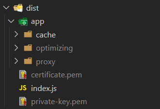

First you need to build a project:

```npm run build```

Then you can start application:

```npm run start``` - to start first task(cache system)

```npm run start-https-server``` - to start second task(https server)

With https server you need to follow the next algorithm:

Provide your SSL credentials after building project in the dist folder: private-key.pem & certificate.pem

should look like this:



file system in this task has configured to follow this algorithm because webpack works badly with poor node.js modules - so it was decided to include pem files in the project build

```npm run start-http-server``` - to start second task(http server)

```npm run start-optimization``` - to start third task(optimization)